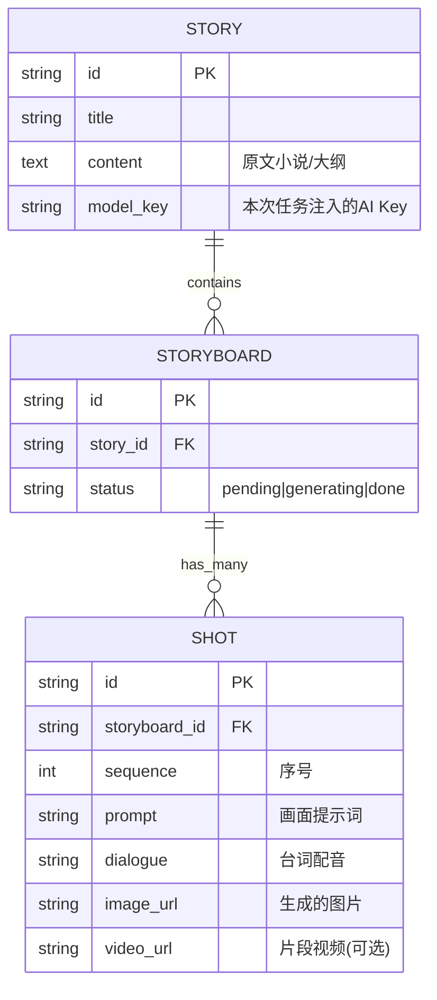

# Architecture & ER Design

## 1. 整体架构分层 (System Architecture)
系统现由三部分构成：
1. **Frontend (Next.js)**: 负责 DreamWriter 极简与硬核模式的渲染，以及新增的 Video Studio 面板。
2. **Proxy Layer (Next.js API Routes)**: 将前端的生成请求附带用户的 API Key 转发。
3. **DreamWriter DB (SQLite/FastAPI)**: 存放用户的小说草稿、大纲。
4. **Huobao Engine (Go 微服务)**: 独立挂载的视频生成引擎，负责解析剧本、发图、FFmpeg合成。

## 2. 实体关系图 (ER Diagram)
仅针对“短剧引擎”部分的数据结构契约（存储在 Huobao 的库表或页面 State 中）：

## 3. UI/CSS 组件契约 (Designer Visual Contract)
**色系规范**：复用 DreamWriter 的 `bg-zinc-950` 与 `text-zinc-100`。
**布局规范**：
- `StoryboardEditor`: `w-1/3` 固定宽度左侧输入框，`flex-1` 瀑布流卡片右侧渲染。
- `GlassMorphism`: 继承 `.glass` 类（白底/黑底 20%透明度毛玻璃）。

---
*Created by Backend Architect & Designer (Auto-Collaboration Pipeline Stage 2)*
