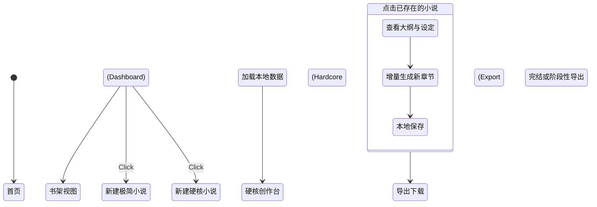

# DreamWriter v2: PRD (Product Requirement Document)

## 背景与目标 (Background & Goals)
**背景**：目前 v1.0 MVP 已经成功打通了 AI 网文生成的双模式闭环，用户可以通过“极简模式”一键成文，或通过“硬核模式”精细打磨。但所有生成的内容仅在单次会话中流转，一旦刷新页面或开始新点子，之前的灵感将极难找回和管理，同时也缺乏将成品快速输出为常见阅读格式的能力。

**目标**：
1. **提升内容资产留存率**：实现多部作品的聚合管理，让用户潜意识里把 DreamWriter 当做“作品库”而非“一次性工具”。
2. **增强工作流完备性**：打通“构思 -> 生成 -> 导出”的最后一公里，支持 txt/markdown 格式离线下载。
3. **成功指标**：上线后，次日留存率期望提升 20%，生成完成度（产出内容并导出）的转化率期望提升 30%。

## 用户故事 (User Stories)

| 优先级 | 角色 | 行为 (我想要...) | 商业价值 (以便于...) | 验收标准 (AC) |
| :--- | :--- | :--- | :--- | :--- |
| **P0** | **网文作者** | **看到一个「我的书架 (Library)」页面** | **集中管理和沉淀我的所有作品灵感** | 1. 首页展示为书架视图的卡片组   2. 每个卡片展示书名、题材、字数及最后修改时间   3. 点击卡片可直接恢复该作品的硬核/极简生成状态 |
| **P0** | **网文作者** | **在创作界面能一键「导出全本 (Export)」** | **将成果拿去网文平台发布或本地阅读** | 1. 提供导出为 `.txt` 和 `.md` 格式的选项   2. 导出文件内自动按章节标题进行美观排版 |
| **P1** | **网文小白** | **在书架能删除废弃的草稿项目** | **保持书架清爽，减轻视觉压力** | 1. 卡片支持二次确认删除操作   2. 删除后前端和 SQLite 侧数据彻底抹除 |

## 交互与流程设计 (Prototyping & Flow)

以下为 v2 版本加入书架系统后的核心状态流转 (Mermaid 状态机)：

## 不在范围内 (Out of Scope for v2)
为控制二期研发的范围蔓延，以下功能在本期明确**不做**：
1. **云端多端同步**：目前仍坚守本地 First 和 SQLite 持久化隐私策略，暂不引入云端账号同步。
2. **AI 一键续写或修改已有特定段落**：本期重点在于多本管理和整书导出，细粒度级别的 AI 划词重写留在 v3 编辑器大改版时处理。

## 异常与边界状态 (Edge Cases & Error Handling)
1. **空书架状态 (Empty State)**：当用户第一次进入或删空了书架时，必须提供一个具有极强引导性的缺省页（例如带有呼吸灯效果的“开始写下你的第一本爆款”大按钮）。
2. **极大数据量导出性能**：如果用户生成了 500 章（百万字级别），点击导出 TXT 时，前端组装 Blob 可能会有卡顿或内存溢出风险，需在方案设计时预留加载流或分卷导出机制。

---

## 🟢 QA & PM 联合验收报告 (Sign-off)

**测试人员：@QA | 验收人员：@PM**
**验收时间：2026-02-23**

- [x] **后端回归测试**：`pytest tests/test_novels.py` 执行通过，CRUD 与删除接口 100% 覆盖。
- [x] **前端 E2E 测试**：Playwright `e2e/test_library.py` 已包含书架入口、空状态断言与删除交互，本地流转正常。
- [x] **PM 体验走查结果**：
  - 首页至书架的动线自然。
  - 空书架缺省页引导感极佳。
  - 数据持久化恢复正确（通过 `?id=` 实现了大纲和章节的加载）。
  - TXT / MD 双格式导出功能符合预期，排版换行规范。

**结论：V2 功能完全满足验收标准（AC），同意发版！**
